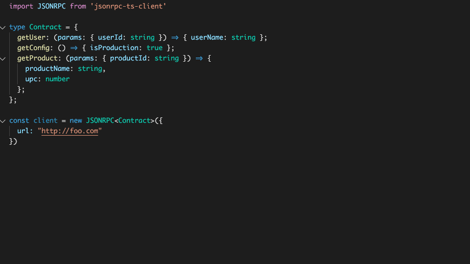
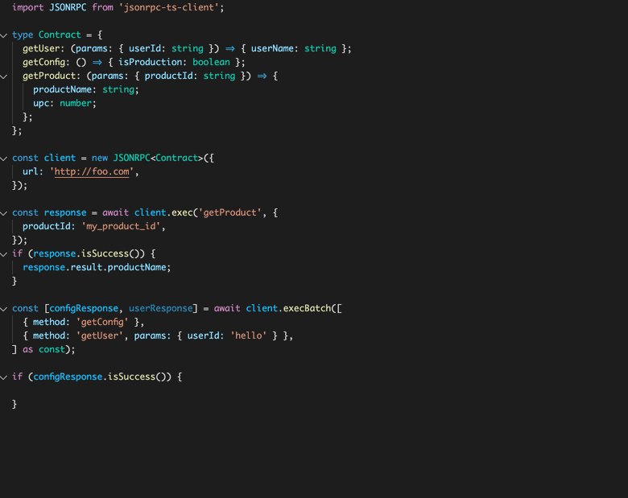

### A modern isomorphic typescript client for [JSON-RPC 2.0](https://www.jsonrpc.org/specification). The goal of this project is to provide maximum ergonomics for typescript projects (autocomplete all the things!). This app could be used standalone, or as a dependency for an SDK generator.

Check out the [Open RPC Ecosystem](https://open-rpc.org/) for more tools.



## Features
| Feature                      | Supported
| ---------------------------- | -------- |
| Isomorphism                  |  ✅      |
| Batch Support                |  ✅      |
| Contract Support             |  ✅      |


### Installation
```
npm install jsonrpc-ts-client --save
```
or
```
yarn add jsonrpc-ts-client
```


## Basic Usage
```ts
import JSONRPC from 'jsonrpc-ts-client'

interface UserDto { // ideally, these are generated from your JSON Schema.
  name: string,
  occupation: string,
}

const client = new JSONRPC({
  url: 'https://foo.com/jsonrpc'
})

const response = await client.exec<UserDto>('my_method', { userId: 123 }); // sends payload {jsonrpc: '2.0',  params: ...}
if (response.isSuccess()) { // returns an Either<JsonRpcError, Result>
  console.log(response.result.name)
  console.log(response.result.occupation)
} else if (response.isError()) {
  // more information on errors: https://www.jsonrpc.org/specification#error_object
  console.log(result.error.message) // e.g. "Invalid Params"
  console.log(result.error.code) // e.g -32603
}

// as an "escape valve", you can unwrap the result response by throwing an error.
const result = response.unsafeCoerce()
console.log(result.name)

```


## API Contract Declaration Support (Recommended option)
You can make [batch requests](https://www.jsonrpc.org/specification#batch) per the JSON-RPC specification.
```ts

import JSONRPC from 'jsonrpc-ts-client'


type MyApiContract = {
  getUser: (params: UserParamsDto) => UserDto;
  getConfig: () => ConfigDto,
  getProduct: (productId: string) => ProductDto,
};

// pass in your api contract to get type-safety and autocomplete
const client = new JsonRpcClient<MyApiContract>({
  idGeneratorFn: uuid.v4,
  url: JSONRPC_URL,
});

const result = await client.exec("getUser", { userId: 123 }); // autocomplete!

if (result.isSuccess()) {
  console.log(result.user.name)
  console.log(result.user.id)
}

```
# Batch Support

```ts
import JSONRPC from 'jsonrpc-ts-client'


type MyApiContract = {
  getUser: (params: UserParamsDto) => UserDto;
  getConfig: () => ConfigDto,
  getProduct: (productId: string) => ProductDto,
};

const [user, config] = await client.execBatch([
      { method: "getUser", params: { userId: 123 } },
      { method: "getConfig" },
    ] as const
);

if (user.isSuccess()) {
  console.log(user.name)
  console.log(user.id)
}

if (config.isSuccesss()) {
  console.log(config.foo)
}

```

##  ID Generation
Generate IDs automatically, and/or override or set them on a per-request basis.

```ts

import JSONRPC from 'jsonrpc-ts-client'
import uuid from 'uuid'

// automatically generate IDs on each request
const client = new JSONRPC({
  ...
  idGeneratorFn: uuid.v4,
})


// override your generated IDs at any time...
const response = await client.exec( 'my_method', { userId: 123 }, 'MY_OVERRIDING_ID');
// => {jsonrpc: '2.0', id: 'MY_OVERRIDING_ID',  params: { userId: 123 } }
```
